CUDA C++ Path Tracer for OpenUSD Scenes
================

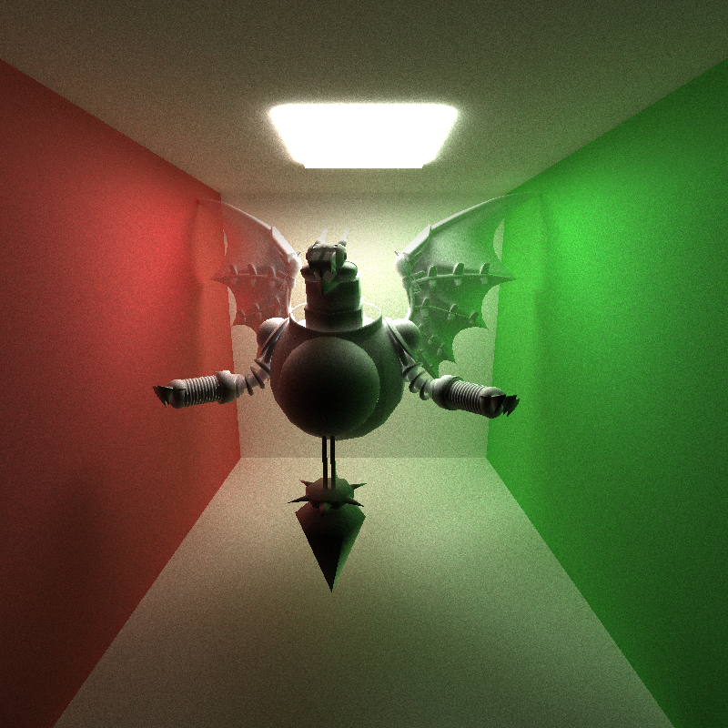

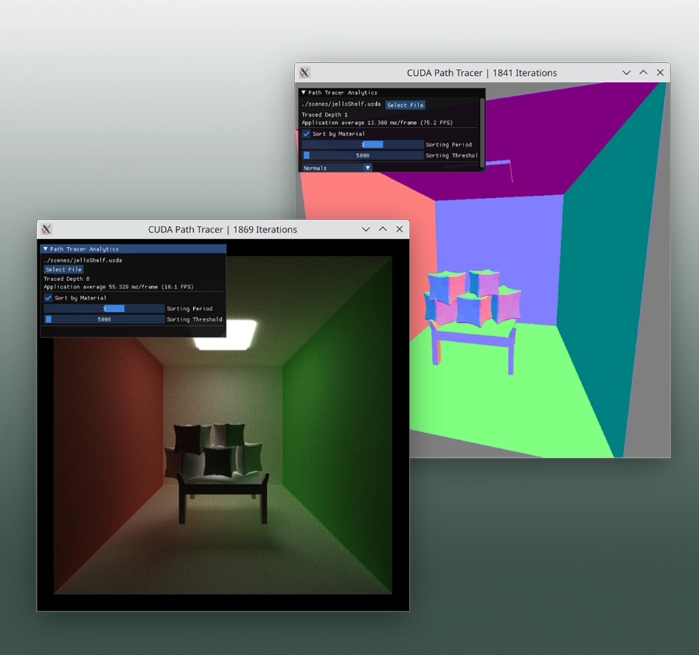

## Overview

This project implements a **CUDA-based parallel GPU path tracer** that simulates **physically based light transport** using **Monte Carlo sampling**.  

It supports **physically based shading** for **diffuse** and **perfect specular surfaces**, with **stochastic antialiasing** for smoother convergence.  

In addition to rendering, the tracer can **import arbitrary OpenUSD (.usd) scenes**, constructing valid meshes and **per-vertex normals** directly from USD geometry.  

The core algorithms are optimized for **GPU parallelism**, featuring **shared-memory** scan, stream compaction, and radix sort to improve raycast efficiency and scene material coherence.

## Table of Contents

- [CUDA C++ Path Tracer for OpenUSD Scenes](#cuda-c-path-tracer-for-openusd-scenes)
  - [Overview](#overview)
  - [Table of Contents](#table-of-contents)
  - [Requirements](#requirements)
  - [Core Features](#core-features)
      - [`scenes/tentaclePlant.usda`](#scenestentacleplantusda)
      - [`scenes/jelloShelf.usda`](#scenesjelloshelfusda)
      - [`scenes/dragon.usda` with smooth mesh and diffuse shading](#scenesdragonusda-with-smooth-mesh-and-diffuse-shading)
  - [System Architecture](#system-architecture)
  - [Performance](#performance)
    - [Scan, Stream Compaction, Radix Sort Standalone Performance](#scan-stream-compaction-radix-sort-standalone-performance)
      - [Stream Compaction within Pathtracer Workflow Performance](#stream-compaction-within-pathtracer-workflow-performance)
      - [Open Space Scene: Unterminated Rays after First 2 Bounces](#open-space-scene-unterminated-rays-after-first-2-bounces)
      - [Closed Space Scene: Unterminated Rays after First 2 Bounces](#closed-space-scene-unterminated-rays-after-first-2-bounces)
    - [Nsight Compute Analytics](#nsight-compute-analytics)
      - [`computeIntersections`](#computeintersections)
      - [`shadeFakeMaterial`](#shadefakematerial)
      - [`kernel_scanIntraBlockShared`](#kernel_scanintrablockshared)
  - [Runbook](#runbook)
  - [IMGUI Overview](#imgui-overview)
  - [TODO](#todo)
    - [Performance](#performance-1)
    - [Rendering](#rendering)
    - [Code Quality](#code-quality)
  - [Fine Details](#fine-details)

## Requirements

- [OpenUSD](https://github.com/PixarAnimationStudios/OpenUSD.git)
- CUDA Toolkit 13.0
- NVIDIA GPU and driver
- GLFW / GLEW libraries
- OpenGL drivers

## Core Features

**Rendering**
- BSDF-based shading for **diffuse** and **perfect specular** surfaces
- **Stochastic antialiasing** through subpixel jittering  

**Parallel Algorithms**
- **Shared-memory scan** and **stream compaction** for ray path termination
- **Material-based sorting** of path segments to reduce warp divergence

**Scene Handling**
- Support for **OpenUSD (.usd)** and a custom **JSON**-based scene format

#### `scenes/tentaclePlant.usda`

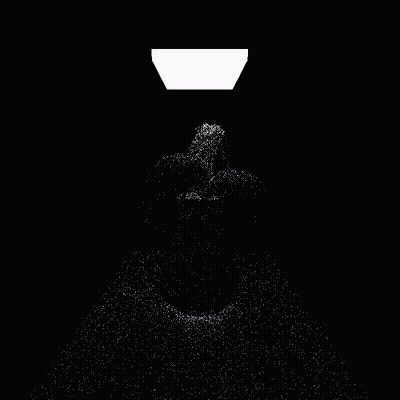


Beyond the core rendering pipeline, this project focuses on both scene handling and GPU performance optimization.  
Namely, I wanted to ensure the path tracer supports **direct import of OpenUSD (.usd) scenes**, constructing meshes, validating topology, and computing per-vertex normals to ensure smooth shading across complex assets. This instantly increased the useability of the renderer, allowing previewing of all arbitrary structured USD stages rather than relying on hard-coded JSON spheres and boxes.

#### `scenes/jelloShelf.usda`

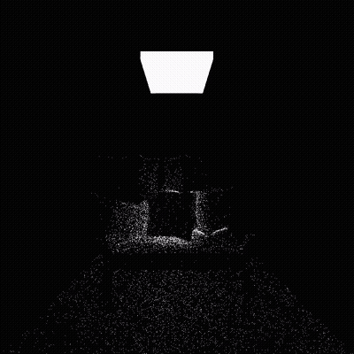


On the computational side, I have implemented from the ground-up parallel algorithms **prefix-scan**, **stream compaction**, and **radix sort**, featuring **shared memory** for quicker read / writes to buffers and comparable performance to external libraries such as Thrust. These operations form the foundation of the pathtracer's work-efficient rendering, allowing 1. rays with no scene intersection or early termination to be compacted away, and 2. remaining paths to be grouped by material type for improved warp coherence.

#### `scenes/dragon.usda` with smooth mesh and diffuse shading

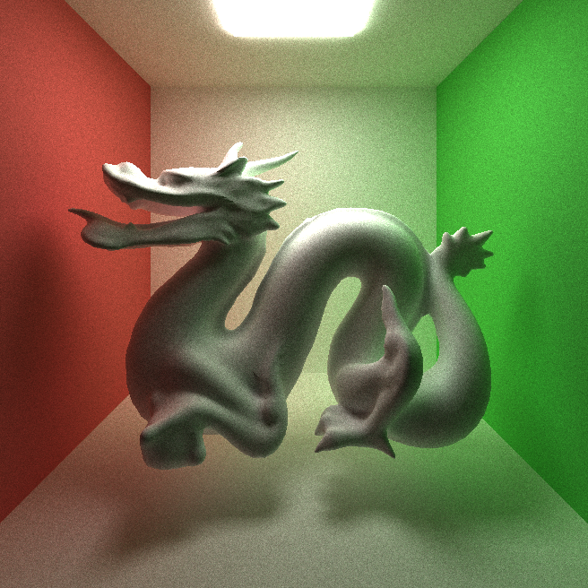

Together, these extensions make the renderer flexible in the scenes it can process and optimal in the way it makes use of GPU parallel kernel calls.

## System Architecture

The renderer follows a wave-style pipeline on the GPU: paths are generated, intersected, shaded, compacted, and (optionally) regrouped by material to improve warp coherence before the next bounce.

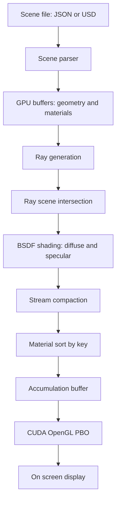

## Performance

### Scan, Stream Compaction, Radix Sort Standalone Performance

Custom CUDA kernels implement **intra-block shared-memory scans** (`kernel_scanIntraBlockShared`) and **block-sum aggregation** (`kernel_addBlockSums`) to efficiently scan and compact terminated paths and keep active rays contiguous in memory.

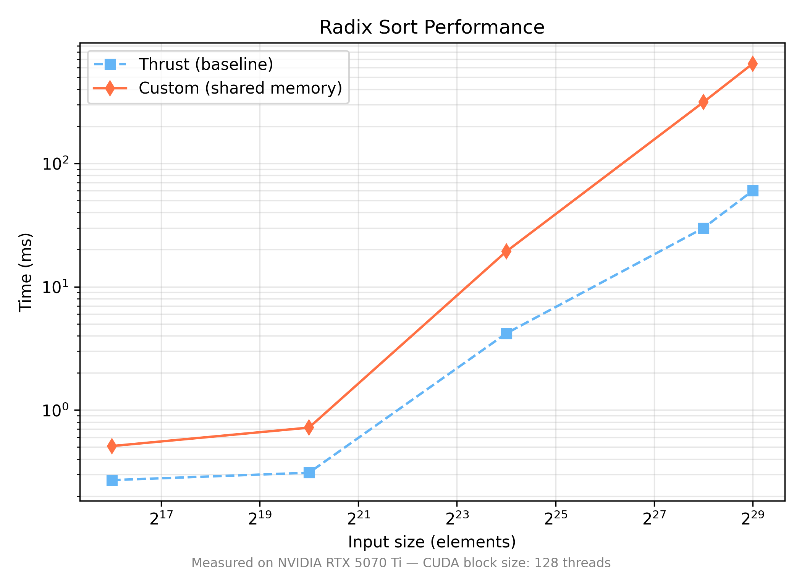

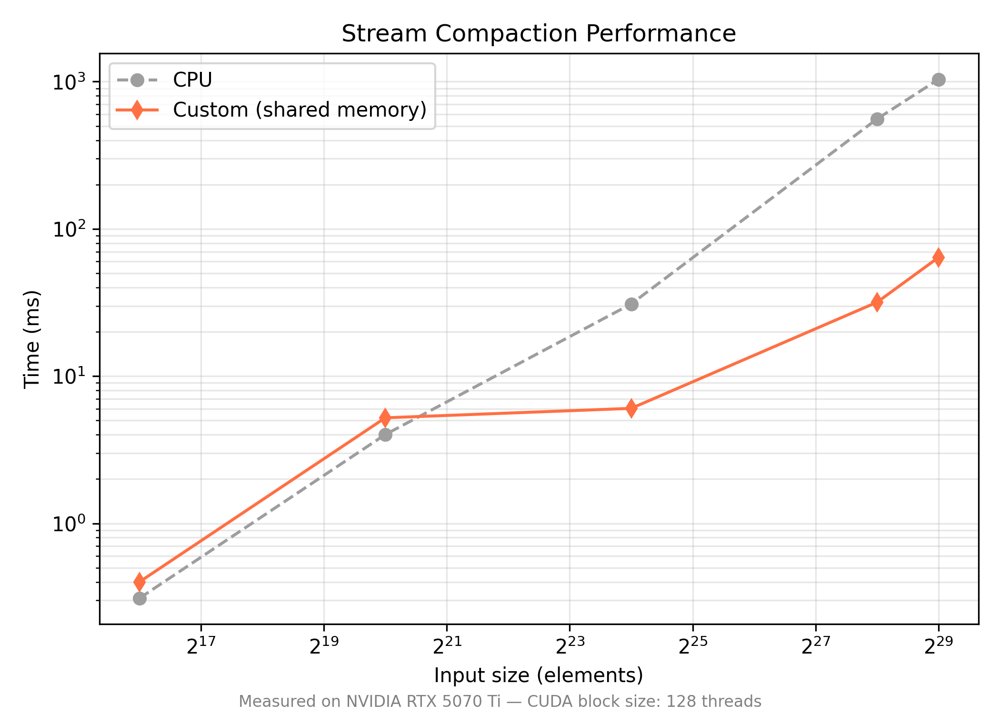

Following compaction in the pathtracer, an **integer-keyed radix sort** groups remaining paths by material type. This approach increases shading coherence by allowing rays with identical BSDF types to execute within the same warp, reducing idle threads and unnecessary divergence in the shading kernel.


Notably, it was difficult to match Thrust baselines with radix sort. Future development involves a GUI flag to switch in Thrust functions for possible speed improvement.

#### Stream Compaction within Pathtracer Workflow Performance

As stream compaction was used in the pathtracer to early terminate any rays that 1. didn't hit anything or 2. hit a light, it is interesting to look at how effective it is during the course of a single frame, where the max depth a ray can travel is 8.

From the graph below, you can see that exponentially more rays will terminate early when looking at an open space scene (refer to [here](#scenesjelloshelfusda) for example of open vs closed scene) as compared to the equivalent model rendered in a closed space scene.

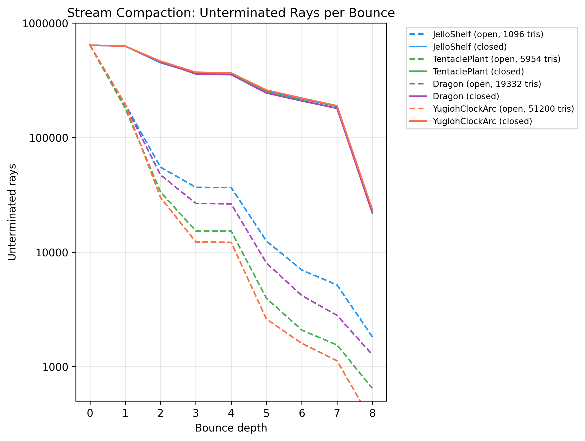

Looking at just the first two bounces for each is even more informative.

**Note that all scenes will start with 640000 rays.**


#### Open Space Scene: Unterminated Rays after First 2 Bounces

| Scene                 |  Bounce 1 | Bounce 2 | Bounce 3 |
| --------------------- | --------: | -------: | -------: |
| JelloShelf            |    194769 |    55075 |    36754 |
| TentaclePlant         |    179413 |    33394 |    15300 |
| Dragon                |    192776 |    47129 |    26569 |
| YugiohClockArc        |    195140 |    29928 |    12252 |
| **Average Remaining** | **29.8%** | **6.5%** | **3.4%** |

#### Closed Space Scene: Unterminated Rays after First 2 Bounces

| Scene                 |  Bounce 1 |  Bounce 2 |  Bounce 3 |
| --------------------- | --------: | --------: | --------: |
| JelloShelf            |    627655 |    449847 |    363658 |
| TentaclePlant         |    627655 |    459953 |    363553 |
| Dragon                |    627655 |    457972 |    358502 |
| YugiohClockArc        |    627655 |    464095 |    371712 |
| **Average Remaining** | **98.1%** | **71.6%** | **57.1%** |

In open scenes, rays quickly terminate after a few bounces. \
In closed scenes, rays persist much longer—remaining over 50 % even after 3 bounces — proving that stream compaction provides greater benefit in open environments where ray termination is frequent.

### Nsight Compute Analytics

Nsight Compute was used to analyze the performance of specific kernels in the CUDA execution. The kernels of interest to me were:

- `computeIntersection`: for each ray segment, finds the nearest interesction, if any, within geometry of the scene.
- `shadeFakeMaterial`: given a discovered intersection, performs a BSDF computation based on the material of the geometry at the point of intersection as well as scatters the ray to its next direction (i.e. random if diffuse, cross-hemisphere reflection if specular).
- `kernel_scanIntraBlockShared`, which handles the bulk of the scan implementation that is needed in stream compaction.

First, it is important to look at the 1. **Compute Throughput**, 2. **Memory Throughput**, and 3. **Duration** of each kernel individually.

#### `computeIntersections`
| Bounce | Compute (SM%) | Memory (%) | Time (microsecond) |
| :----: | :-----------: | :--------: | :-------: |
|    1   |     52.45     |    52.45   |   22.23   |
|    2   |     46.74     |    46.74   |   24.97   |
|    3   |     44.39     |    44.39   |   18.76   |
|    4   |     44.01     |    44.01   |   15.35   |
|    5   |     44.19     |    44.19   |   15.00   |
|    6   |     43.12     |    43.12   |   10.98   |
|    7   |     42.43     |    42.43   |    9.46   |
|    8   |     42.18     |    42.18   |    8.17   |

#### `shadeFakeMaterial`
| Bounce | Compute (SM%) | Memory (%) | Time (microsecond) |
| :----: | :-----------: | :--------: | :-------: |
|    1   |     12.38     |    92.27   |   456.80  |
|    2   |      9.19     |    54.13   |   643.62  |
|    3   |      7.80     |    52.41   |   543.55  |
|    4   |      7.18     |    68.82   |   68.70   |
|    5   |      7.88     |    72.99   |   367.94  |
|    6   |      8.31     |    74.15   |   295.23  |
|    7   |      8.41     |    76.22   |   249.98  |
|    8   |      6.48     |    63.84   |   39.46   |

#### `kernel_scanIntraBlockShared`
| Bounce | Compute (SM%) | Memory (%) | Time (microsecond) |
| :----: | :-----------: | :--------: | :-------: |
|    1   |     51.87     |    76.12   |   52.58   |
|    2   |     52.14     |    76.53   |   53.02   |
|    3   |     45.84     |    67.15   |   29.95   |
|    4   |     45.78     |    67.08   |   30.14   |
|    5   |     46.23     |    67.75   |   30.34   |
|    6   |     34.85     |    56.19   |   17.89   |
|    7   |     33.55     |    49.05   |   20.13   |
|    8   |     38.18     |    55.82   |   17.98   |


As bounces progress, the total compute, memory, and time usage steadily decrease, showing how stream compaction effectively reduces active rays each iteration. \
By later bounces, GPU workload drops across all kernels, confirming that compacted ray buffers minimize unnecessary intersection and shading work, improving overall efficiency per frame.

Then, comparing the different metrics between the kernels is done via stacked bar charts, allowing us to visualize how much resources are dedicated to each process for every bounce.

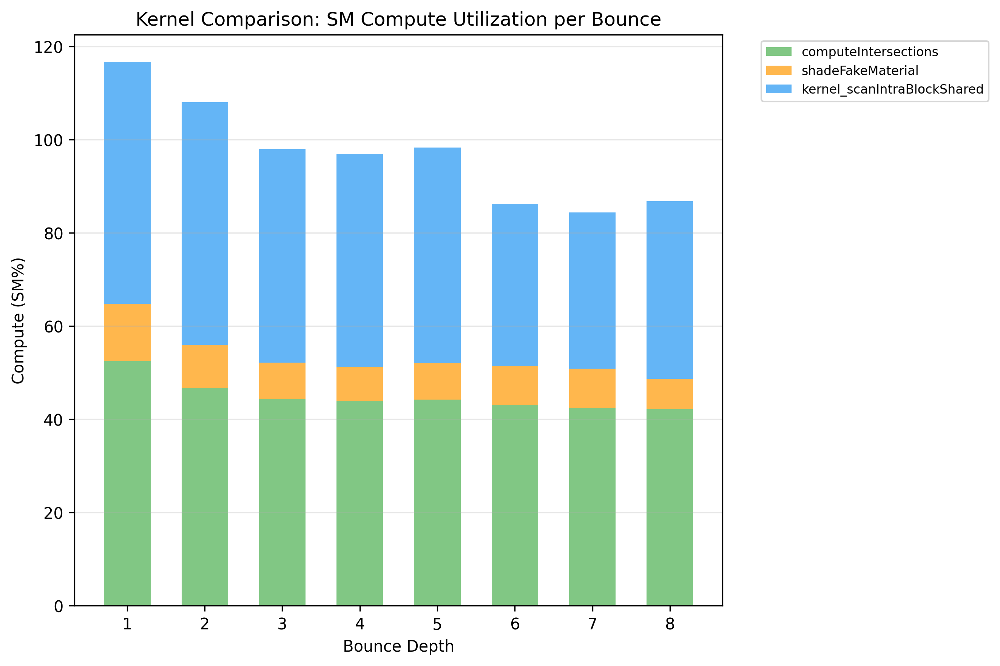

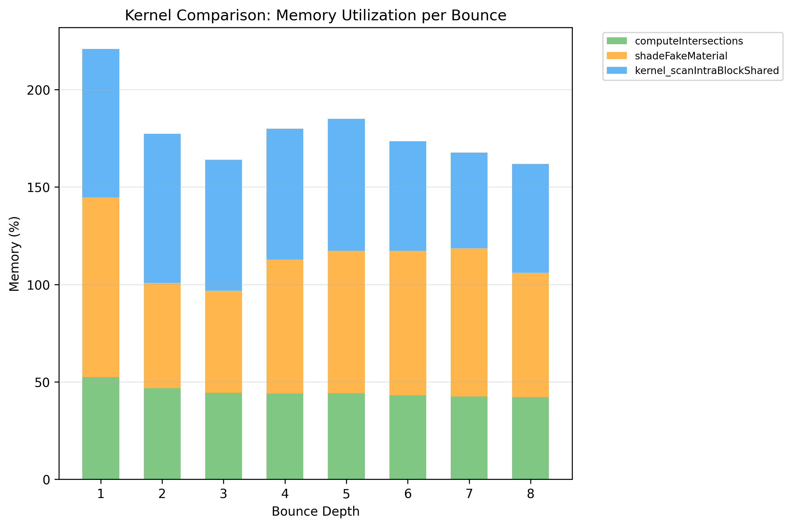

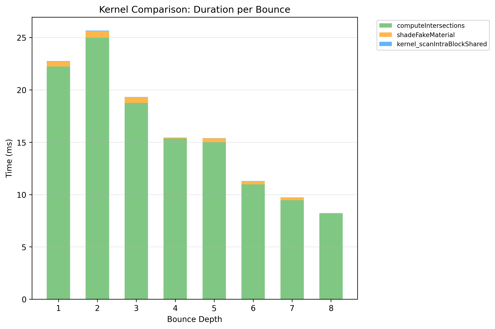

**Note**, the `computeIntersections` kernel heavily dominates the execution in runtime. This is also obvious in the Nsight interface here:

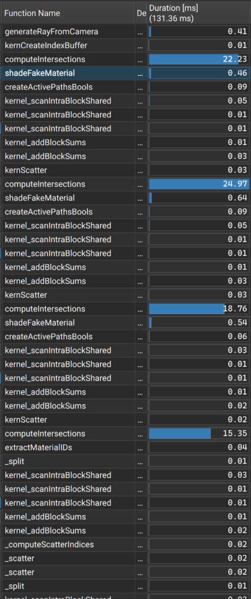

Optimizations are planned to eliminate this bottleneck in performance, such as implementing BVH, which will create a means to traverse the scene geometry through tree-like searching rather than 1D brute-force searching.

## Runbook

To build the project, again make sure you first have [OpenUSD](https://github.com/PixarAnimationStudios/OpenUSD.git) installed in your environment. I find that following the [build instructions](https://github.com/PixarAnimationStudios/OpenUSD/blob/dev/BUILDING.md) in the project GitHub is the most foolproof way to do this, but make sure to look at the [supported versions](https://github.com/PixarAnimationStudios/OpenUSD/blob/dev/VERSIONS.md) for your OS. There are also small notes and flags scattered throughout that will truly "make or break" your build, so make sure to read slowly and carefully.

Configure CMake with the variables `USD_ROOT`, pointing to the root of your USD installation. Unfortunately, the `ENABLE_USD=OFF` option should not be relied on at this time so you **must** have USD installed to run this pathtracer. This option will be useable in the near future.

Example configure commands:

```bash
mkdir build
cd build

cmake .. -DCMAKE_BUILD_TYPE=Release -DUSD_ROOT=/opt/usd
```

Build the cmake project:

```bash
# e.g. if using `UNIX Makefiles` generator
make -j8
```

Run the created executable with a desired scene within `scenes/` as an argument, or without any arguments to view the default Cornell Box scene

```bash
# from project root dir
# option 1: choose scene
build/bin/Release/cuda_path_tracer scenes/tentaclePlant.usda

# option 2: load up default scene
build/bin/Release/cuda_path_tracer
```

If the application window looks like this after loading the default scene, you are good to go!

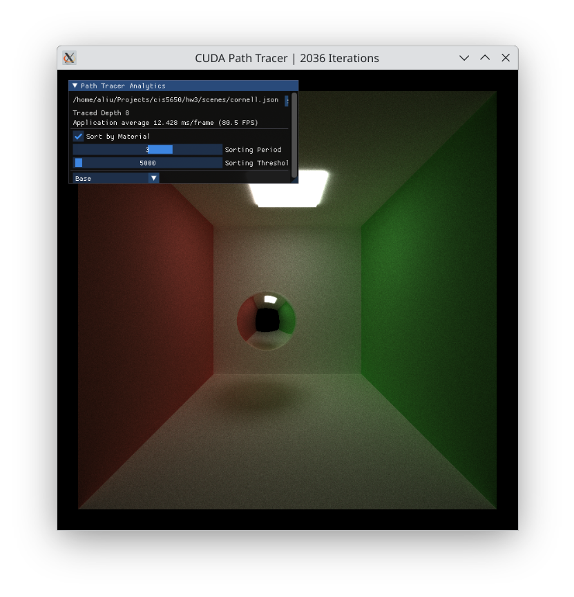

Also, the included files `CMakePresets.json`, `Makefile`, and the `.vscode` folder may be helpful to exemplify the runbook.

## IMGUI Overview

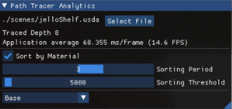

The renderer includes a lightweight ImGui control panel for inspecting scene state, performance metrics, and material-sorting behavior during rendering.

| Panel / Element           | Description                                                                                                  |
| ------------------------- | ------------------------------------------------------------------------------------------------------------ |
| **Path Tracer Analytics** | Displays the currently loaded scene file, traced path depth, and per-frame timing (ms and FPS).              |
| **Select File**           | Opens a system file browser for dynamically loading `.usd` or `.json` scenes without restarting the program. |
| **Sort by Material**      | Enables path sorting by material ID after stream compaction to improve warp coherence in shading.            |
| **Sorting Period**        | Controls how often the material sort is triggered (e.g. value of 3, materials are sorted every 3rd bounce).                                           |
| **Sorting Threshold**     | Minimum number of remaining rays required to perform sorting.                                                |
| **Active view Dropdown**         | Lets users switch between shader modes or debug visualizations (normals vs base default shaded).                    |

The normals view will look like this:

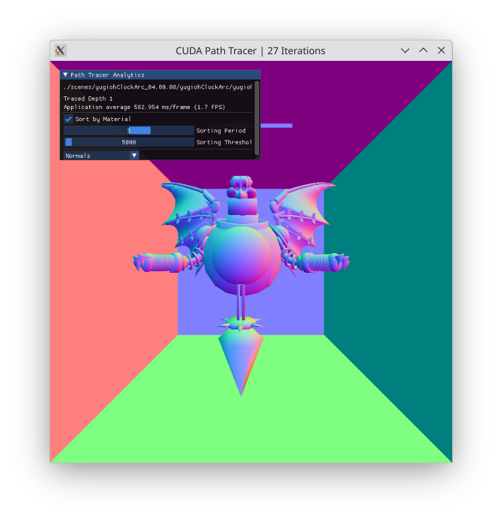

## TODO

### Performance
- [ ] Implement BVH traversal  
- [ ] Add Thrust fallback toggle  
- [ ] Optimize material sorting  
- [ ] Improve USD loading  

### Rendering
- [ ] Support HDRI sampling
- [ ] Support misc texture sampling
- [ ] Support MaterialX

### Code Quality
- [ ] Enable `ENABLE_USD=OFF` build option  
- [ ] Extend GUI options

## Fine Details
- Amy Liu
  - [Personal Website](https://amyliu.dev), [LinkedIn](https://linkedin.com/in/miyalana), [Github](https://github.com/mialana).
- Tested on: Fedora 42 KDE Plasma, Wayland Protocol, Optimus GPU (Intel(R) Core(TM) Ultra 9 275HX 32GiB, NVIDIA GeForce RTX 5070Ti 12227MiB)